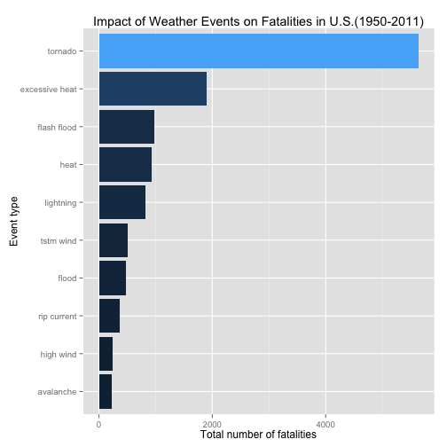
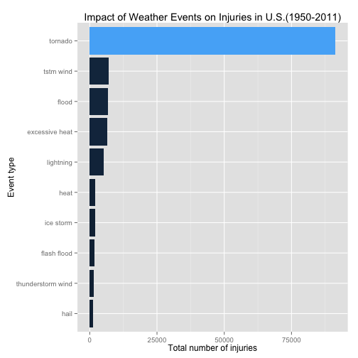
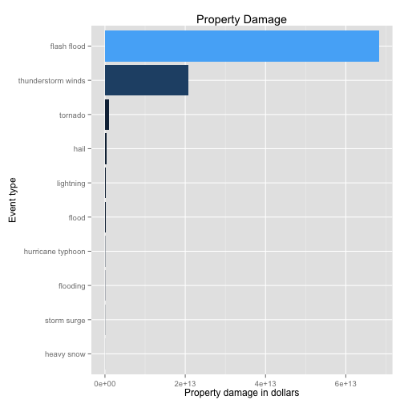
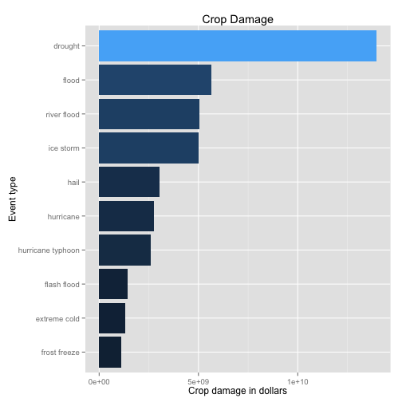

##Introduction

Storms and other severe weather events can cause both public health and economic problems for communities and municipalities. Many severe events can result in fatalities, injuries, and property damage, and preventing such outcomes to the extent possible is a key concern.

This project involves exploring the U.S. National Oceanic and Atmospheric Administration's (NOAA) storm database. This database tracks characteristics of major storms and weather events in the United States, including when and where they occur, as well as estimates of any fatalities, injuries, and property damage.

##Synopsis

The analysis revealed that the tornadoes are by far the most dangerous event that affects the population health; the second dangerous event was excessive heat. Flash flood and thunderstorm winds caused a severe impact on property damage, also drought and flood caused an economic loss in crops. All these factors contributed to affect the economy in the US.

##Loading and processing the data


```r
library("plyr")
library("ggplot2")
library("utils")

data_url <- "https://d396qusza40orc.cloudfront.net/repdata%2Fdata%2FStormData.csv.bz2"

if (!file.exists("repdata-data-StormData.csv.bz2")) {
    download.file(data_url, destfile = "repdata-data-StormData.csv.bz2")
    fileName = "repdata-data-StormData.csv"
    bunzip2("repdata-data-StormData.csv.bz2", fileName, overwrite = TRUE)
}


storm_data <- read.csv("repdata-data-StormData.csv")
event_types <- tolower(storm_data$EVTYPE)
event_types <- gsub("[[:blank:][:punct:]+]", " ", event_types)
storm_data$EVTYPE <- event_types
```

### processing the data from most dangerous weather events that affects population health:


```r
casualties <- ddply(storm_data, .(EVTYPE), summarize,
                    fatalities = sum(FATALITIES),
                    injuries = sum(INJURIES))

fatalities_evt <- head(casualties[order(casualties$fatalities, decreasing = T), ], 10)
injuries_evt <- head(casualties[order(casualties$injuries, decreasing = T), ], 10)
```

### Most dangerous events that casued casualties among population:


```r
fatalities_evt[, c("EVTYPE", "fatalities")]
```

```
##             EVTYPE fatalities
## 741        tornado       5633
## 116 excessive heat       1903
## 138    flash flood        978
## 240           heat        937
## 410      lightning        816
## 762      tstm wind        504
## 154          flood        470
## 515    rip current        368
## 314      high wind        248
## 19       avalanche        224
```

### Most dangerous events that casued injuries among population:


```r
injuries_evt[, c("EVTYPE", "injuries")]
```

```
##                EVTYPE injuries
## 741           tornado    91346
## 762         tstm wind     6957
## 154             flood     6789
## 116    excessive heat     6525
## 410         lightning     5230
## 240              heat     2100
## 382         ice storm     1975
## 138       flash flood     1777
## 671 thunderstorm wind     1488
## 209              hail     1361
```


## 1. Across the United States, which types of events (as indicated in the EVTYPE variable) are most harmful with respect to population health?


```r
plot1 <- ggplot(data=fatalities_evt,
    aes(x=reorder(EVTYPE, fatalities), y=fatalities, fill=fatalities)) +
    geom_bar(stat="identity") +
    ggtitle("Impact of Weather Events on Fatalities in U.S.(1950-2011)") +
    coord_flip() +
    ylab("Total number of fatalities") +
    xlab("Event type") +
    theme(legend.position="none")

print(plot1)
```

 

```r
plot2 <- ggplot(data=injuries_evt,
             aes(x=reorder(EVTYPE, injuries), y=injuries, fill=injuries)) +
    geom_bar(stat="identity") +
    ggtitle("Impact of Weather Events on Injuries in U.S.(1950-2011)") +
    coord_flip() + 
    ylab("Total number of injuries") +
    xlab("Event type") +
    theme(legend.position="none")

print(plot2)
```

 


## 2. Across the United States, which types of events have the greatest economic consequences?


```r
exp <- function(e) {
    
    # h -> hundred
    # k -> thousand
    # m -> million
    # b -> billion
    
  if (e %in% c('h', 'H'))
        return(2)
    else if (e %in% c('k', 'K'))
        return(3)
    else if (e %in% c('m', 'M'))
        return(6)
    else if (e %in% c('b', 'B'))
        return(9)
    else if (!is.na(as.numeric(e)))
        return(as.numeric(e))
    else if (e %in% c('', '-', '?', '+'))
        return(0)
    else {
        stop("invalid value.")
    }
}

propdmg_exp <- sapply(storm_data$PROPDMGEXP, FUN=exp)
storm_data$prop_dmg <- storm_data$PROPDMG * (10 ** propdmg_exp)
crop_dmg_exp <- sapply(storm_data$CROPDMGEXP, FUN=exp)
storm_data$crop_dmg <- storm_data$CROPDMG * (10 ** crop_dmg_exp)

economic_loss <- ddply(storm_data, .(EVTYPE), summarize,
                   prop_dmg = sum(prop_dmg),
                   crop_dmg = sum(crop_dmg))

economic_loss <- economic_loss[(economic_loss$prop_dmg > 0 | economic_loss$crop_dmg > 0), ]
prop_dmg_events <- head(economic_loss[order(economic_loss$prop_dmg, decreasing = T), ], 10)
crop_dmg_events <- head(economic_loss[order(economic_loss$crop_dmg, decreasing = T), ], 10)


p3 <- ggplot(data=prop_dmg_events,
    aes(x=reorder(EVTYPE, prop_dmg), y=prop_dmg, fill=prop_dmg )) +
    geom_bar(stat="identity") +
    ggtitle("Property Damage") +
    coord_flip() +
    xlab("Event type") +
    ylab("Property damage in dollars") +
    theme(legend.position="none")

print(p3)
```

 

```r
p4 <- ggplot(data=crop_dmg_events,
    aes(x=reorder(EVTYPE, crop_dmg), y=crop_dmg, fill=crop_dmg)) +
    geom_bar(stat="identity") +
     ggtitle("Crop Damage") +
    coord_flip() + 
    xlab("Event type") +
    ylab("Crop damage in dollars") + 
    theme(legend.position="none")

print(p4)
```

 

